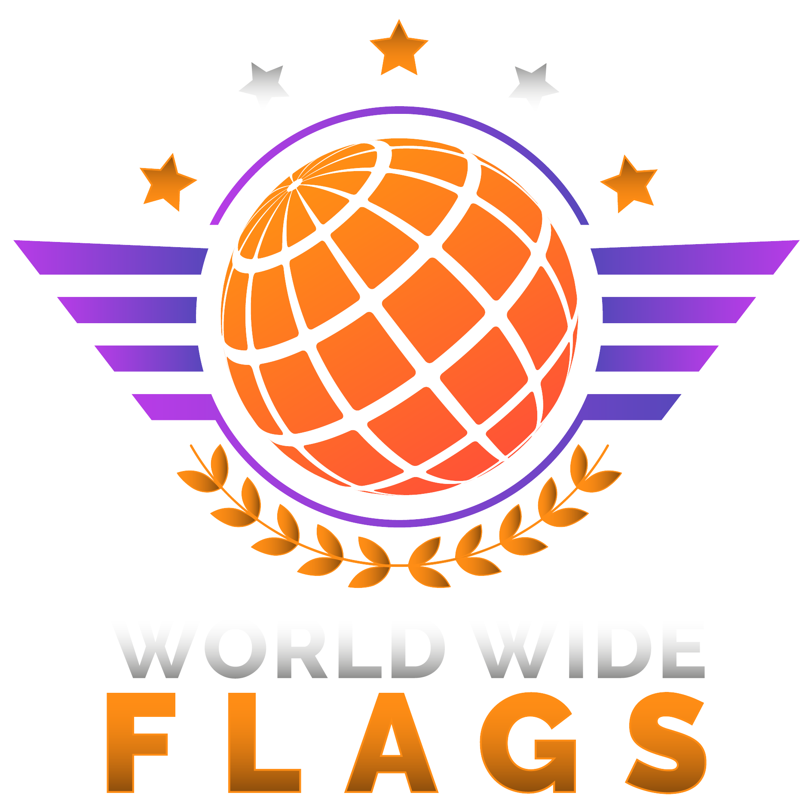

# Hi there 👋

You have stumbled onto my personal README. Here you can learn more about who I am and what I do, if you're interested.

Besides, you can contact me using any of the ways listed above, feel free to do so! I'm open to invitations and other opportunities.

### Areas of interest
1. **🛡️Infosec / CTF :** member of [<picture></picture> World Wide Flags](https://ctftime.org/team/283853) (top 50 worldwide), also [LCD](https://ctftime.org/team/270230/), historically also [xls team](https://ctftime.org/team/271856) and as a guest member in other teams, specializing in cryptography/math/PPC.\
Interested in developing CTF tasks of my specialization. If you need any feel free to reach out!
2. **🔬Science, mathematics and physics:** interested in knowing more about math or physics of different kinds, for infosec/coding or otherwise, both as casual learning and as professional/academic research. I don't have any actual experience, but would love to try. If you do research and think I could be helpful to you, please reach out!
3. **🕹️Games :** [Tetr.io](https://ch.tetr.io/u/maximxls) S- rank, [osu!](https://osu.ppy.sh/users/10891536) 2493pp. I play different genres, but love indie puzzles the most.
4. **🔍Algorithmic programming :** previously active at [Codeforces](https://codeforces.com/profile/maximxls) and in Russian olympiads. Achieved a 2nd award in the Moscow olympiad for school students.
5. **🧑‍💻Coding :** I would consider invites for project and hackathons, you can see samples of my code here on Github (not the best of my code, honestly, but better than nothing)

### Some of my skills
- Programming: several years of Python scripting, some experience using Rust and Go.
- Speaking: native Russian, B2 - Upper Intermediate English.
- Cryptography: advanced RSA, basic AES, Diffie-Hellman, Elliptic curves, lattices.
- CTF besides cryptography: basic pwn, reverse engineering, forensics, jail escape, web exploitation, networking.
- Algorithms: basic dynamic programming, segment trees and treaps, basic graph and string algos.
- Linux, Docker, basic deploy.

### Employment
I don't plan to be employed until 2026 to focus on my education.
