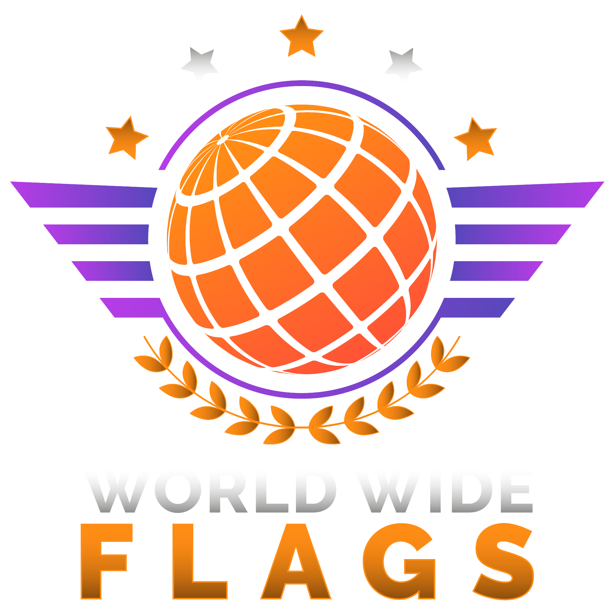

# Hi there 👋

You have stumbled onto my personal README. Here you can learn more about who I am and what I do, if you're interested.

Besides, you can contact me using any of the ways listed above, feel free to do so! I'm open to invitations and other opportunities.

## Areas of interest
1. **🛡️Infosec / CTF :** I'm a member of [<picture></picture> World Wide Flags](https://ctftime.org/team/283853) (top 50 worldwide), also [LCD](https://ctftime.org/team/270230/), historically also [xls team](https://ctftime.org/team/271856) and sometimes in other teams, specializing in cryptography/math/PPC/Rust. See my writeups over on [writeups.xls.msk.ru](https://writeups.xls.msk.ru/)\
Interested in developing CTF tasks of my specialization or doing vulnerability research. Feel free to reach out!
2. **🔒Systems programming :** Interested in all kinds of systems programming, I'm (slowly) working on implementing a firmware for a electronic badge, a language interpreter and a hobby operating system. I would love to get into developing operating systems, interpreters/compilers, formal verification software or even hardware!
3. **📖Infosec education :** Sometimes I teach CTF cryptography! You might find some recordings of my lectures (they probably are in Russian currently) over on my [Youtube channel](https://www.youtube.com/@Maximxls). If you need that kind of service, let me know!
4. **🕹️Games :** I play different genres, but love indie puzzles the most. Some of my favourite games are: To the moon series, Outer Wilds, SIGNALIS. Also [Tetr.io](https://ch.tetr.io/u/maximxls) S- rank, [osu!](https://osu.ppy.sh/users/10891536) 2493pp.
5. **🔍Algorithmic programming :** previously active at [Codeforces](https://codeforces.com/profile/maximxls) and in Russian olympiads. Achieved a 2nd award in the Moscow olympiad for school students.
6. **🧑‍💻Coding :** I would consider invites for project and hackathons, you can see samples of my code here on Github (not the best of my code, honestly, but better than nothing)

## Some of my skills
- Programming: 🥇Python, 🥈Rust, 🥉Go, Kotlin
- Language: native Russian, B2 - Upper Intermediate English, starting to learn Japanese!
- Cryptography: Familiar with all the common cryptosystems, lattice based cryptanalysis, differential cryptanalysis.
- CTF besides cryptography: basic pwn techniques, networking, fuzzing, debugging, static binary analysis.
- Algorithms: dynamic programming, binary trees, sorting, asymptotic analysis, all the basic stuff.
- Linux, Docker, basic deploy stuff.

## Collection of the things I've done
#### Education, attending conferences
- Currently on my second year of HSE FCS SE.
- Летняя школа CTF 2024, 2025 (CTF/Infosec summer school)
- Positive Hack Days Fest 2025
- OFFZONE 2025
- Underconf 2025
- Standoff Talks 2025
#### Teaching
- Perparing high school students for GoIT CTF (2025)
- НЕЙМАРК.ИТ-Академия по ИБ 2025 (CTF summer school for high schoolers)
- Школа киберзащиты Неймарк 2025-2026 (online courses for high schoolers)
- MIEM CTF (CTF club for students at HSE MIEM)
#### Developing/organizing
- World Wide CTF 2024, 2025 (2500 teams)
- Tasks for MIACTF, Ozon CTF.
- A/D CTF services for CenterCTF, OmCTF, Russian CTF Cup.
- Stuff on this Github account (not much here sadly).
#### CTF/Olympiads
- 1st places: Кубок ФСП России и Чемпионат ФСП России по спортивному программированию в дисциплине "программирование систем информационной безопасности" в 2025 году
- 3rd place: Всероссийская олимпиады "Я - профессионал" в направлении "Информационная и кибербезопасность (бакалавриат)".
- 1st place as LCD: VolgaCTF 2025.
- 1st places as xls team: VrnCTF 2023 и 2024.
- Top 3 as WWF: TJCTF 2025, BYUCTF 2025, UMassCTF 2025, BITSCTF 2025, 0xL4ugh CTF.
- 2nd place: Первенство ФСП России 2024.
- 3rd place: M*CTF Student 2024.
- 1st place at SibCTF 2025.
- A bunch of cool tasks first-blooded! Some of them you can check out [here](https://writeups.xls.msk.ru/).
